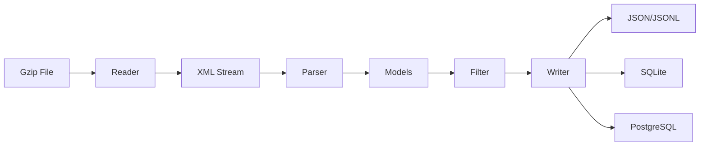

# Architecture

## Workflow

## Components

### Readers

Readers open gzip-compressed files and provide a byte stream. They optionally track bytes read for progress reporting.

### Parsers

Parsers extract and validate data from XML. They convert to typed models with enums where appropriate. Validation happens once, at parse time.

### Models

NamedTuple classes representing Discogs entities (Artist, Label, Release, MasterRelease). Immutable and memory-efficient.

### Filters

Filters transform or drop records based on expressions. Support boolean logic (AND/OR) and comparison operators.

### Writers

Writers serialize models to output formats. They should not need to re-validate. Database writers handle batching, schema creation, and normalization.
